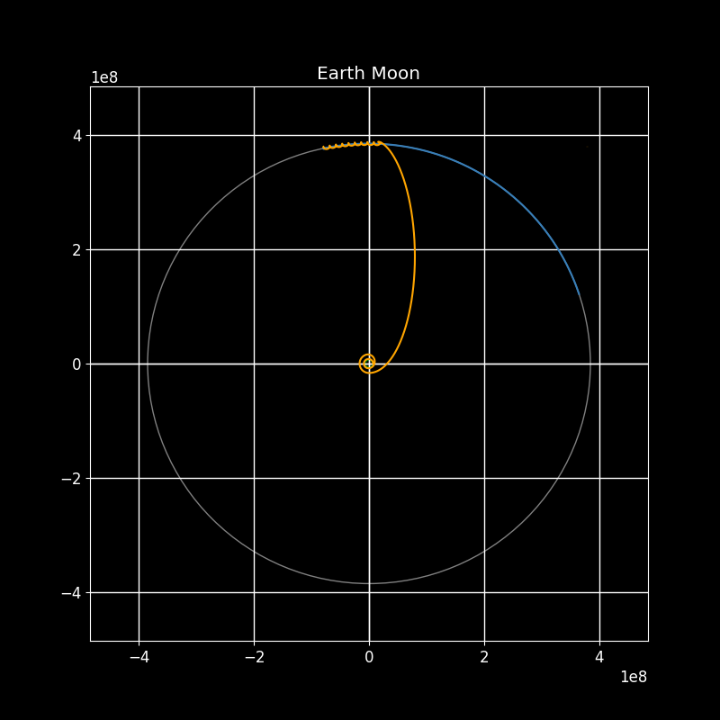
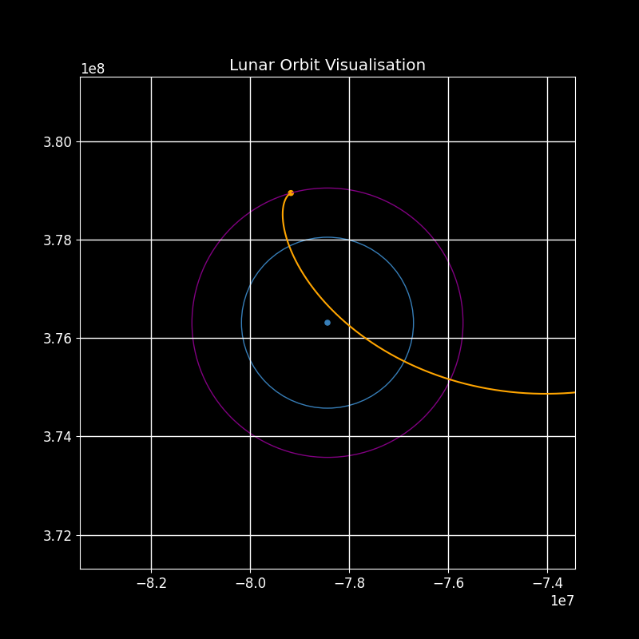
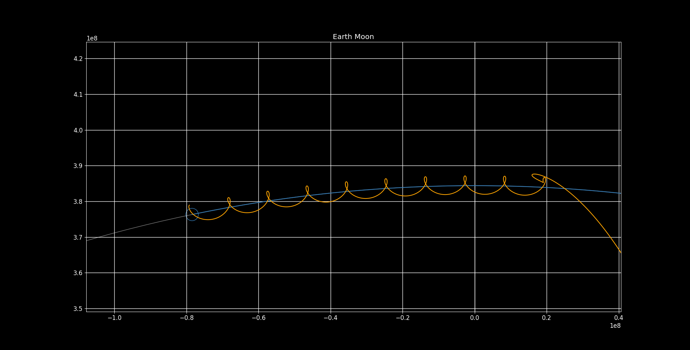
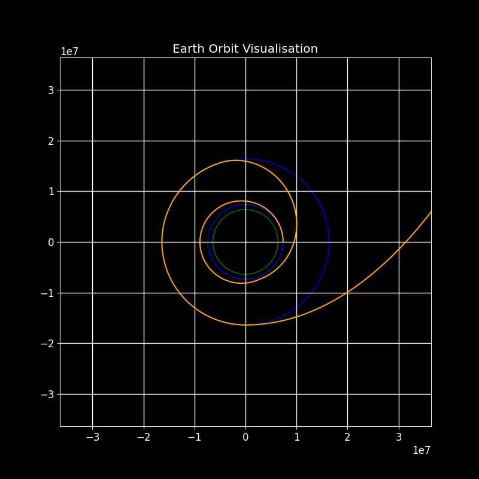
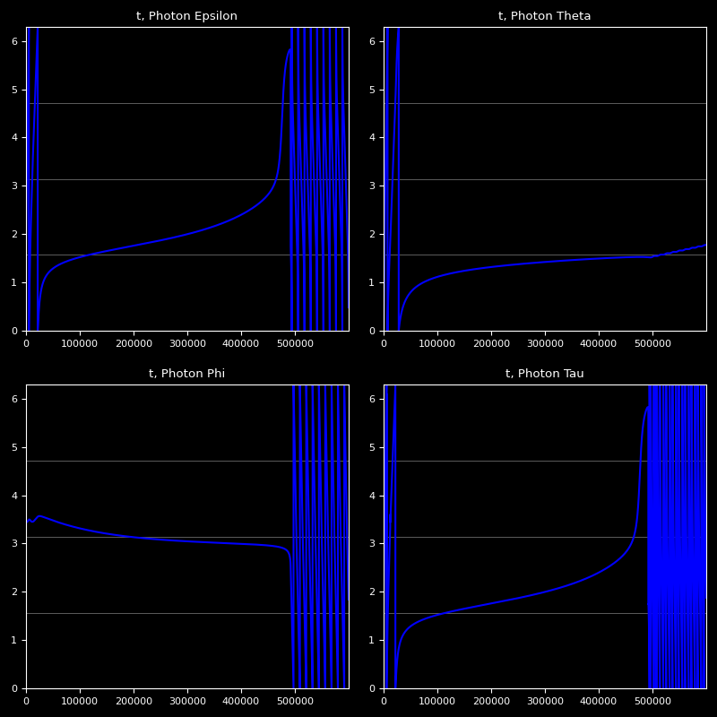
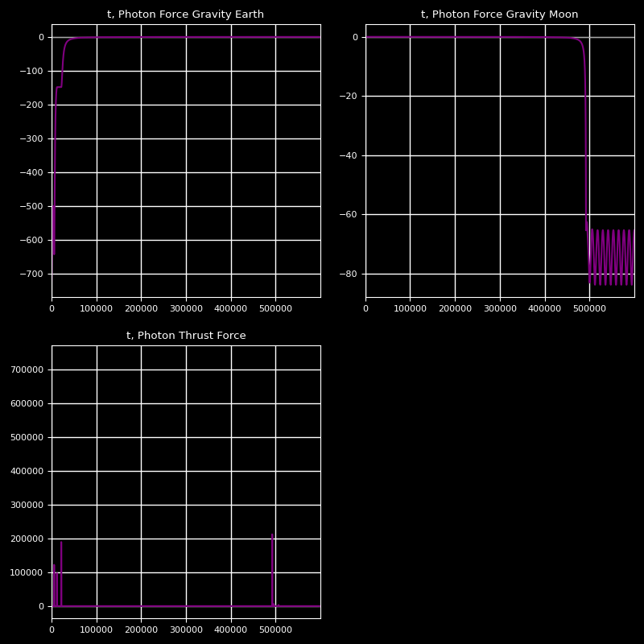
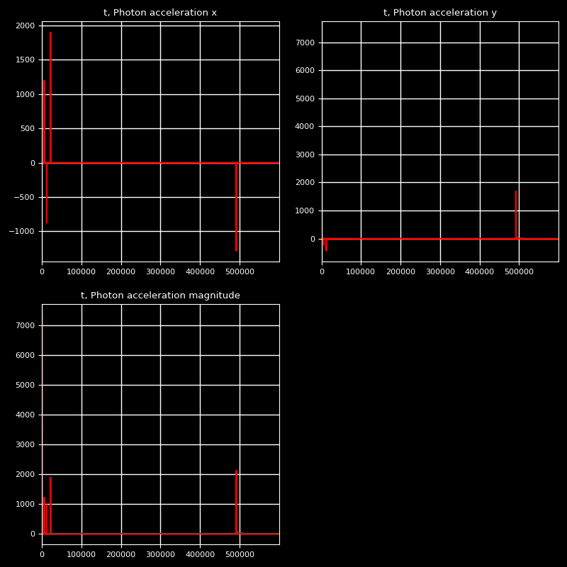
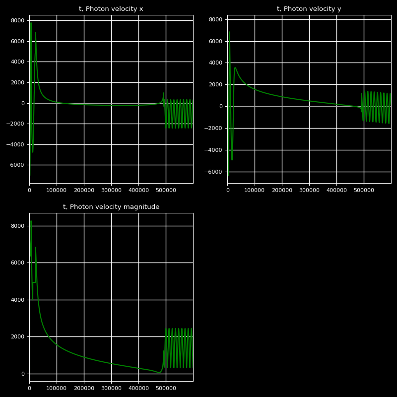
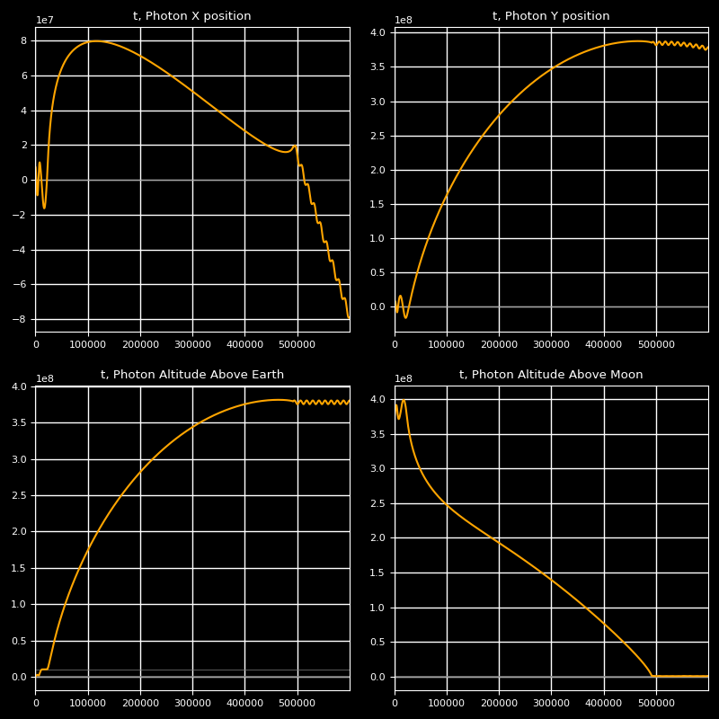

# Lunar Satellite Propagator

This program is an implementation of a 3DOF propagator for low-earth-orbit and lunar trajectories, and uses minimum energy Hohmann transfers to carry out the orbit raising. All equations used in this are derived from first principles.

  
  

  
  

  
  

  
  

## Assumptions

  - Mass of the satellite is constant i.e. not considering fuel expended during orbit changes.
  - The earth and the moon are in the same inclination, and all no inclination changes are considered.
  - Small amounts of friction in LEO are not considered.
  - Gravitational forces acting on the satellite are from only the Earth and the Moon.
  - The earth and the Moon are perfectly circular.
  - The satellite is a simple point mass.
  - The Moon's orbit around Earth is perfectly circular.

## Installation

You must have the following python libraries installed:

  - matplotlib
  - numpy

## Usage

Running propagate.py will run the main simulation loop.

Satellite parameters can be changed within the global_params.py file.

## Contributing
Pull requests are welcome. For major changes, please open an issue first to discuss what you would like to change.

Please make sure to update tests as appropriate.

## License
[MIT](https://choosealicense.com/licenses/mit/)
